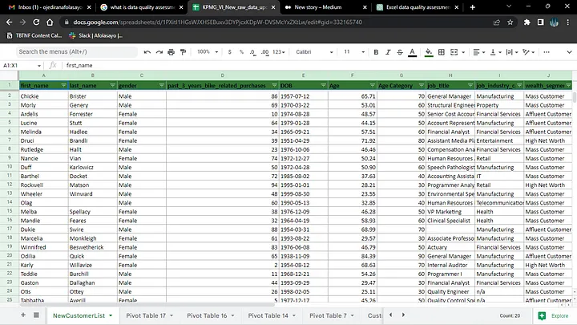
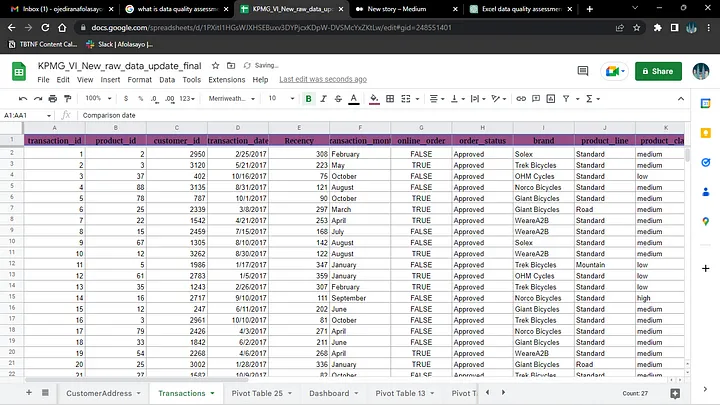
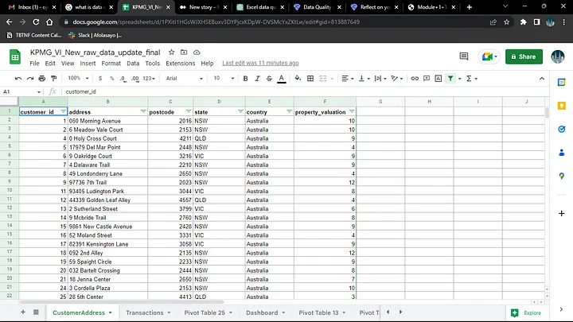
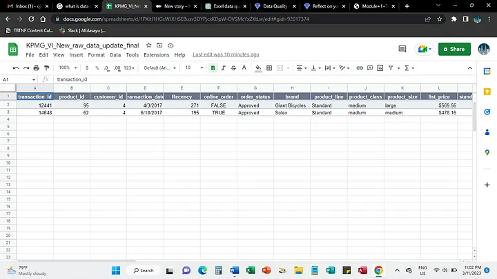

# SPROCKET-CENTRAL-PTY-LTD (Data Quality Assessment)

Sprocket Central Pty Ltd needs help with its customer and transaction data.

# INTRODUCTION

Data quality assessment is the application of business-approved database quality requirements to a selected data set. Data quality requirements should be expressed in terms of data quality dimensions and should be aligned with organizational objectives, targets, and thresholds should be established for each dimension. A data quality assessment aims to identify incorrect data, estimate the impact on the business processes, and implement corrective action.

"The better the quality of the dataset, the better chance you will be able to use it to drive company growth.”
---

# ABOUT SPROCKET CENTRAL

Sprocket Central is a medium-sized Bike and Cycling accessories organization in Australia. The organization needs help with its large dataset which contains 20,000 current customers, transactions data, and an additional dataset containing a list of 1,000 potential customers with their demographics and attributes who have no prior transaction with Sprocket Central.

# TASK

Primarily, Sprocket Central Pty Ltd needs help with its customer and transaction data. The organization has a large dataset relating to its customers, but its team is unsure how to effectively analyze it to help optimism its marketing strategy. Review the data quality to ensure that it is ready for our analysis in phase two. Remember to take note of any assumptions or issues we need to go back to the client on. As well as recommendations going forward to mitigate current data quality concerns.

The client provided KPMG with 3 datasets:

- Customer Demographic
- Customer Addresses
- Transactions data in the past 3 months
---

# METHODOLOGY

For each of the provided dataset I;

i. Define Data Quality Criteria: I started by defining the criteria that determine data quality for each use. I categories them into common criteria include accuracy, completeness, consistency, timeliness, and uniqueness.

ii. Data Profiling: I utilized Excel Sheet filter to identify data quality issues such as missing data, outliers, anomalies, and inconsistencies in each column.

iii. Data Cleaning: Progressing, I identify and cleaned up data errors. This can include removing duplicate values, correcting misspellings, and formatting data correctly.

iv. Data Validation: With data validation, I was able to validate data against a set of rules or constraints. This can include checking for valid dates, and numerical values within a specified range, and ensuring that data is entered in the correct format.

v. New column: I created a new column to determine the age of the customers = NOW()-F3)/365

vi. Data Consistency: Check for consistency across different data sources and within the dataset itself. Use conditional formatting and formulas to highlight discrepancies and outliers.

vii. Time/Date: I evaluated whether the data is up-to-date and relevant for the intended analysis, especially for time-sensitive decision-making processes.

# INSIGHTS

There were several quality issues encountered, here are some suggestions on how to mitigate and improve them;

A. Multiple customer ids were found present on the ‘Customer Address Table and Transaction Table’ but not found on Customer Demographics.

· Suggestion; Do ensure that the tables are from the same period as these data are not similar to each other which may distort the results.

B. There are various columns with missing values and inconsistent fields (first names, last name, job title, job industry, online order, and gender).

· Suggestion;

- These records have been removed from the datasets to avoid the missing values affecting the prediction.

· Data has been cleaned to avoid multiple representations.

· Avoid abbreviations.

. The collection of information should be done in data form, not in text form.

C. There are data types with similar character.

· Suggestion;

- Data types can be converted from text to value or necessary data type.

· Also, ensure consistency in the data types.

# CONCLUSION

In conclusion, Data quality assessment is the process of evaluating the reliability, accuracy, consistency, and completeness of data to ensure its fitness for specific purposes and decision-making. It involves systematic analysis and evaluation of data to identify any discrepancies, errors, or issues that might affect the overall integrity and usefulness of the data. Overall, data quality assessment is essential for ensuring that data-driven decisions are based on reliable and accurate information. It helps organizations uncover potential issues, make necessary improvements, and maintain high-quality data to drive successful outcomes.
